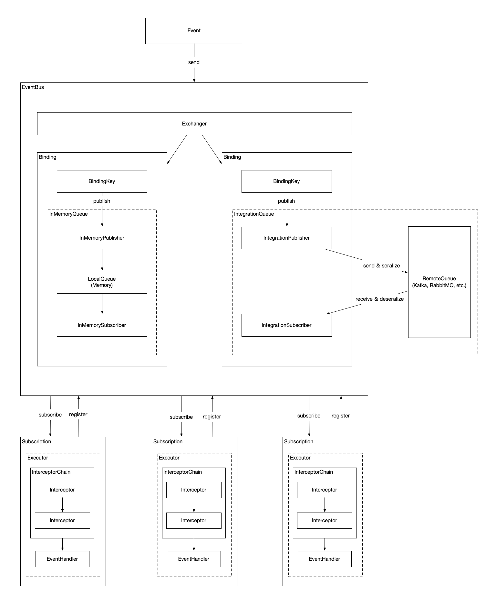

# dracula（德古拉）

> Dracula可说是历史上最有名的吸血鬼，其作为吸血鬼的代表曾在多部描写吸血鬼的影片中出现。

## 简介

dracula是用于简化DDD相关编程的工具包。该项目取`dracula`之名是希望该工具能使业务模型更加充点血，减少或者避免贫血模型的产生。

## dracula-ddd

提供DDD中聚合、实体、事件等相关概念的抽象类。

## dracula-eventbus

支持 *事件驱动架构EDA（Event Driven Architecture）*中事件的使用，对事件提供更好的语义集成。

### 架构

### 特性

- 支持本地事件的发送和消费

- 支持与Kafka、RabbitMQ等消息中间件的集成

- 支持同步、异步消费

- 支持消息拦截器

- 支持消息路由

- 支持消息发送的事务（通过本地消息表实现）

- 支持消息集成时序列化和反序列化规则的配置

  

